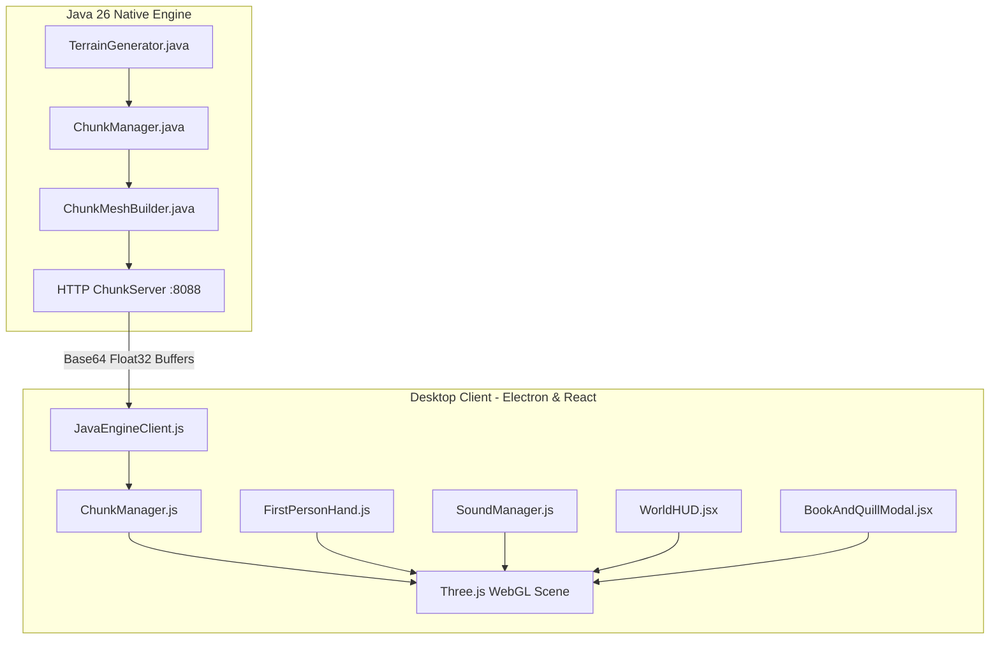

# 📜 Minecraft Journal (MC-Journal)

[](https://jdk.java.net/)
[](https://threejs.org/)
[](https://react.dev/)
[](https://www.electronjs.org/)
[](https://vitejs.dev/)

An immersive, standalone **singleplayer Minecraft journaling desktop application**. Built with a **native Java 26 voxel engine** streaming hardware-accelerated vertex buffers to a high-fidelity **Three.js WebGL** renderer, pairing authentic Minecraft sandbox mechanics with an in-world quest & journal system.

---

## 🌟 Key Features

### ⚡ Native Java 26 Chunk & Meshing Engine
- **Parallel Multi-Threaded Meshing**: Utilizes Java 26 virtual threads to compute 6-face exposed face culling and ambient occlusion across 100 chunks simultaneously.
- **Per-Vertex Ambient Occlusion (AO)**: 4-level smooth light curvature ($1.0, 0.78, 0.58, 0.42$) with anisotropic diagonal flip correction.
- **Direct Binary Vertex Buffer Streaming**: Streams little-endian base64 float buffers directly to the GPU via REST endpoints (`/api/meshes`, `/api/chunks`), delivering zero client-side meshing overhead.
- **Top-Face De-tiling**: Dynamic $90^\circ$ UV pseudo-random rotations to eliminate tiling artifacts on stone, dirt, bedrock, and sand.

### 🎮 Authentic Core Minecraft Mechanics
- **Right-Click Block Placement**: Raycasts against block normal faces (`x + nx, y + ny, z + nz`) with full player AABB bounding-box collision validation.
- **Left-Click Progressive Mining**: Features authentic 10-stage fracture decals (`destroy_stage_0.png` through `destroy_stage_9.png`) with dynamic particle explosions.
- **3D Held Viewmodel Items**: Steve's first-person hand renders 3D voxel models matching the active hotbar slot (Book & Quill, Diamond Pickaxe, Oak Planks, Wild Poppy, Torch, Cobblestone, Sand, Birch Log).
- **9-Slot Hotbar & Quick Selection**: Hotbar navigation via number keys `1`–`9` and mouse scroll wheel.
- **Fluid Movement Physics**: Smooth WASD locomotion, double-tap `W` or `Ctrl` sprinting with dynamic FOV scaling ($70^\circ \to 79^\circ$), `Shift` sneaking with eye-height depression ($1.62 \to 1.27$), auto step-up over 0.5-block ledges, and ceiling bonking physics.

### 🔊 Procedural Web Audio Sound Engine
- **Surface-Matched Footsteps**: Rhythmic step sounds tuned dynamically for `grass`, `stone`, `wood`, `sand`, and `water`.
- **Mining & Breaking SFX**: Continuous hit ticks every $0.18\text{s}$ while mining and acoustic crunch shatter upon block destruction.
- **Tactile Feedback**: Block placement pop/thud, hurt grunts on fall impact ($> 3$ blocks), and parchment page turns for the Book & Quill.

### 📚 In-Game Journaling & Quest System
- **Interactive Lectern Points of Interest**: Approach in-world Lecterns, Shrine altars, and Crystal Lake research posts to open and read lore.
- **Book & Quill Interface**: Write and record rich journal entries categorized by tags (`quest`, `building`, `mining`, `exploration`, `lore`).
- **In-World Journal Drawer**: Access your complete library of world logs at any time from the HUD or Escape Menu.
- **Local & Cloud Persistence**: Dual-layer storage backing via LocalStorage and optional Supabase database sync.

### 🎨 Authentic Visuals & Atmosphere
- **Faithful 64x Texture Pipeline**: Crisp 64x pixel art composite texture atlas with 4x anisotropic filtering.
- **Atmospheric Sky & Clouds**: Gradient sky dome with continuous drifting Minecraft voxel cloud planes at $Y=128$.
- **Underwater Visuals**: Custom blue fog density shifts and underwater lighting when swimming.

---

## 🕹️ Controls Reference

| Input | Action |
| :--- | :--- |
| **`W` / `A` / `S` / `D`** | Walk Forward / Left / Backward / Right |
| **`Space`** | Jump |
| **`Left Shift`** | Sneak (Lower eye height & ledge protection) |
| **`Left Ctrl` / Double-Tap `W`** | Sprint (Increases speed & FOV) |
| **`Mouse Move`** | Look / Aim (Pointer Lock) |
| **`Left-Click` (Hold)** | Mine Targeted Block |
| **`Right-Click`** | Place Held Block / Interact with Lectern |
| **`1` – `9`** | Select Hotbar Slot (1–9) |
| **`Mouse Scroll Wheel`** | Cycle Hotbar Slots |
| **`E`** | Open Book & Quill / Interact with Nearby POI |
| **`Escape`** | Toggle Game Menu / Free Cursor |
| **`F11`** | Toggle Fullscreen Mode |

---

## 🏗️ Architecture Overview



---

## 🚀 Getting Started

### Prerequisites
- **Node.js**: v18.0.0 or higher ([Download Node.js](https://nodejs.org/))
- **Java Development Kit (JDK)**: JDK 21+ / OpenJDK 26 ([Download JDK](https://adoptium.net/))

### Installation

1. Clone the repository:
   ```bash
   git clone https://github.com/Aadhithya-T/Journal-MC.git
   cd Journal-MC
   ```

2. Install frontend dependencies:
   ```bash
   npm install
   ```

3. Compile the Java Voxel Engine:
   ```bash
   npm run java:build
   ```

---

## 💻 Running the Application

### 🎮 Standalone Desktop App (Recommended)
Compile the Java engine, bundle the client, and launch the Electron application:
```bash
npm start
```

### 🌐 Web Browser Dev Server
Start the local Vite development server with Hot Module Replacement (HMR):
```bash
npm run dev
```

### 📦 Production Build
Build the optimized production desktop distribution:
```bash
npm run build
```

---

## 📁 Project Structure

```
mc-journal/
├── electron/                   # Electron main & preload scripts
│   ├── main.cjs                # App window lifecycle & Java process launcher
│   └── preload.cjs             # IPC bridge
├── engine/                     # Native Java 26 Voxel Engine
│   └── src/com/mcjournal/
│       ├── Block.java          # Block type registry & properties
│       ├── Chunk.java          # 16x32x16 chunk data structures
│       ├── ChunkManager.java   # Multi-chunk memory & virtual thread meshing
│       ├── ChunkMeshBuilder.java # Native AO, face culling, float buffers
│       ├── ChunkServer.java    # Embedded HTTP server (:8088)
│       ├── SimplexNoise.java   # 2D/3D Simplex noise generator
│       └── TerrainGenerator.java # Procedural terrain, rivers, caves, POIs
├── public/                     # Static assets & texture packs
│   └── texturepacks/faithful64x/ # Faithful 64x PNG textures & destroy stages
├── src/                        # React + Three.js Frontend
│   ├── components/
│   │   ├── world/              # 3D World Canvas, HUD & Modals
│   │   │   ├── chunk/          # ChunkManager, TextureAtlas, MeshBuilder
│   │   │   ├── BookAndQuillModal.jsx # Journal entry editor
│   │   │   ├── FirstPersonHand.js    # 3D viewmodel hand & held items
│   │   │   ├── MinecraftWorldCanvas.jsx # Main Three.js render loop & physics
│   │   │   ├── SoundManager.js       # Web Audio API sound synthesizer
│   │   │   ├── SteveCharacter.js     # 3D Steve player model
│   │   │   └── WorldHUD.jsx          # Hotbar, hearts, hunger & coordinates
│   │   ├── background/         # Video background selector
│   │   └── ui/                 # Reusable Minecraft-styled buttons & inputs
│   ├── context/                # React Contexts (World, Background)
│   ├── hooks/                  # Custom hooks (useWorld, useJournalEntries)
│   ├── routes/                 # App routes (ModeSelect, WorldSetup, Journal)
│   └── App.jsx                 # Router & provider root
├── package.json                # Project scripts & dependencies
└── vite.config.js              # Vite build configuration
```

---

## 📜 License

This project is open-source and available under the **MIT License**.
Textures and assets belong to their respective creators under community fair-use terms.
